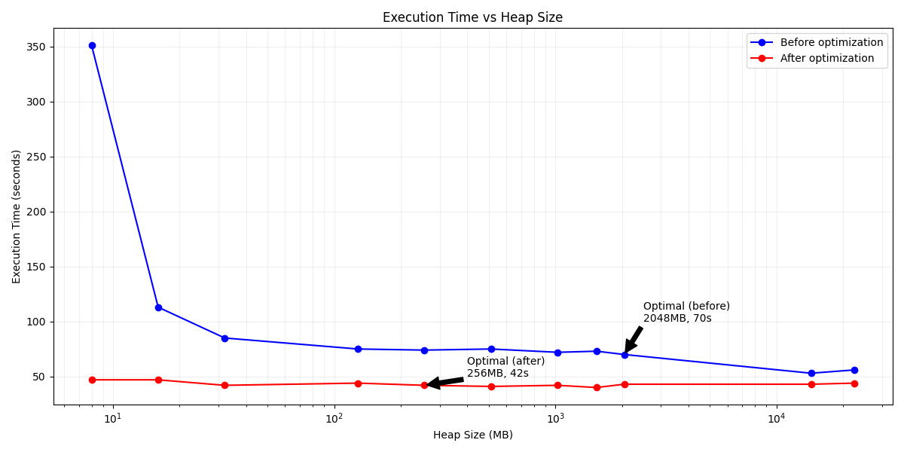

# hw08-gc

Run CalcDemo:

```shell
../gradlew :hw08-gc:run --no-build-cache --no-configuration-cache
```

Results:

| Heap size             | Time before optimization   | Time after optimization  |
|-----------------------|----------------------------|--------------------------|
| -Xms8m -Xmx8m         | spend msec:351024, sec:351 | spend msec:47361, sec:47 |
| -Xms16m -Xmx16m       | spend msec:113323, sec:113 | spend msec:47363, sec:47 |
| -Xms32m -Xmx32m       | spend msec:85193, sec:85   | spend msec:42791, sec:42 |
| -Xms128m -Xmx128m     | spend msec:75383, sec:75   | spend msec:44594, sec:44 |
| -Xms256m -Xmx256m     | spend msec:74663, sec:74   | spend msec:42787, sec:42 |
| -Xms512m -Xmx512m     | spend msec:75149, sec:75   | spend msec:41962, sec:41 |
| -Xms1024m -Xmx1024m   | spend msec:72485, sec:72   | spend msec:42871, sec:42 |
| -Xms1536m -Xmx1536m   | spend msec:73022, sec:73   | spend msec:40286, sec:40 |
| -Xms2048m -Xmx2048m   | spend msec:70591, sec:70   | spend msec:43382, sec:43 |
| -Xms14336m -Xmx14336m | spend msec:53784, sec:53   | spend msec:43023, sec:43 |
| -Xms22528m -Xmx22528m | spend msec:56230, sec:56   | spend msec:44391, sec:44 |

| Optimal             | Heap size           | Time                     |
|---------------------|---------------------|--------------------------|
| Before optimization | -Xms2048m -Xmx2048m | spend msec:70591, sec:70 |
| After optimization  | -Xms256m -Xmx256m   | spend msec:42787, sec:42 |

---

Visualization:



Graph source:

[graph.py](graph.py)

Executable snippet:

https://python-fiddle.com/saved/5e9cecc5-5de1-46d4-89f2-b35e1284f340
